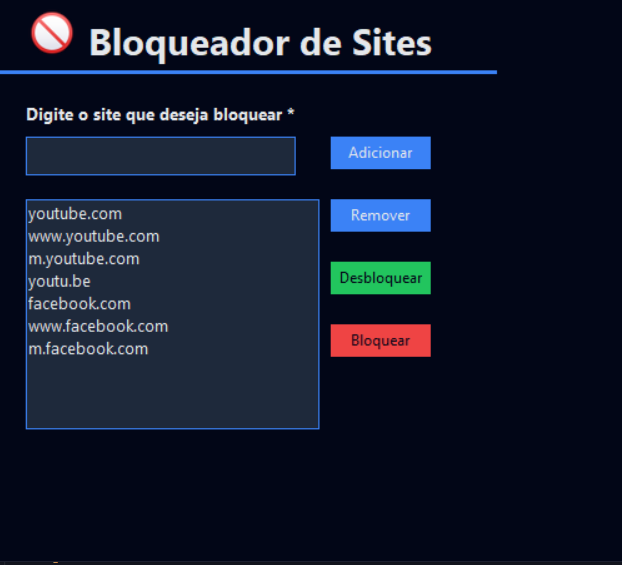

# 🚫 Bloqueador de Sites – Aplicação Desktop


<p align="center">
  
</p>

---

## 📌 Sobre o Projeto
O **Bloqueador de Sites** é uma aplicação desktop desenvolvida em Python que permite restringir ou liberar o acesso a sites específicos no sistema operacional Windows. O bloqueio é realizado por meio da edição controlada do arquivo `hosts`, garantindo eficiência e baixo consumo de recursos.

---

## ✨ Funcionalidades
- 🚫 Bloqueio de sites personalizados
- 🔓 Desbloqueio rápido com um clique
- 💾 Persistência de dados em arquivo CSV
- 🛡️ Verificação de permissões de administrador
- 🎨 Interface moderna em tema escuro

---

## 🛠️ Tecnologias Utilizadas
- **Linguagem:** Python 3.10+
- **Interface Gráfica:** Tkinter
- **Imagens:** Pillow (PIL)
- **Persistência:** CSV
- **Sistema Operacional:** Windows

---

## 📘 Documentação
Para mais detalhes sobre o funcionamento do sistema:
- 📄 **Documentação Técnica:** `docs/tecnico.md`
- 👤 **Manual do Usuário:** `docs/manual-usuario.md`

---

## 🚀 Melhorias Futuras
- [ ] ⏰ Agendamento de bloqueio por horário
- [ ] 🔐 Proteção por senha
- [ ] 📊 Relatórios de uso
- [ ] 🌙 Modo claro/escuro dinâmico

---

## 📦 Instalação das Dependências
Antes de executar o sistema, instale a dependência necessária utilizando o comando abaixo:
pip install pillow

 ▶️ Execução do Programa

 ⚠️ Atenção: Este programa precisa ser executado como Administrador, pois realiza alterações no arquivo hosts do Windows.
Execute o comando abaixo em um terminal aberto com privilégios de administrador:

python main.py

## 📄 Licença
Este projeto está sob a **Licença MIT**. Uso livre para fins educacionais e pessoais.

## ⚙️ Instalação e Execução

1. Clone o repositório:
```bash
git clone https://github.com/emival122/bloqueador-sites.git
